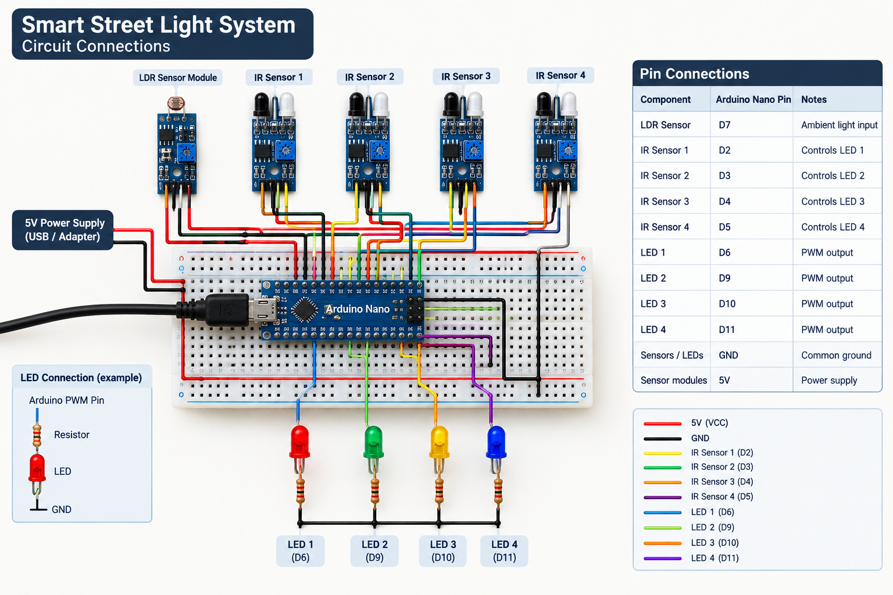
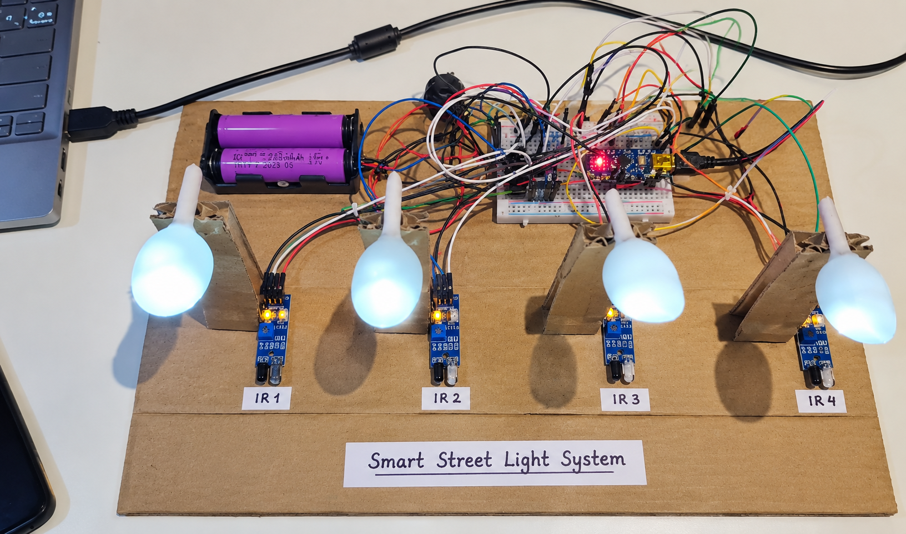

````markdown
# 💡 Smart Street Light System

An Arduino Nano based smart street lighting prototype that automatically controls individual LED brightness based on vehicle or object detection.

The system uses multiple IR sensors to detect movement and independently control four LEDs. When no vehicle or object is detected, the corresponding LED remains dim. When an object is detected, the corresponding LED switches to full brightness.

---

## 🎥 Project Demo

### Watch the system in action

[](https://youtu.be/j2KZ5oQoFCw)

**▶ [Watch the full project demonstration on YouTube](https://youtu.be/j2KZ5oQoFCw)**

The repository also contains the original project video:

`video/smart-street-light-demo.mp4`

---

## 🎯 Objective

The objective of this project is to demonstrate an automated street lighting system that can reduce unnecessary power consumption by controlling individual street lights based on vehicle or object detection.

Instead of keeping every light at full brightness continuously, the system keeps the lights at a lower brightness when there is no detected movement and increases the brightness of the corresponding light when an object is detected.

---

## ⚙️ How the System Works

The prototype uses an Arduino Nano as the main controller.

1. Four IR sensors continuously monitor their corresponding sections.
2. When no vehicle or object is detected, the corresponding LED operates at dim brightness.
3. When an IR sensor detects a vehicle or object, the corresponding LED switches to full brightness.
4. When the object is no longer detected, the LED returns to dim brightness.
5. Each IR sensor controls its corresponding LED independently.

### Example

```text
IR Sensor 1 detects vehicle
          ↓
Arduino Nano receives signal
          ↓
LED 1 → FULL BRIGHTNESS

IR Sensor 1 detects nothing
          ↓
LED 1 → DIM BRIGHTNESS
```
````

The same logic is applied independently to all four sensor/LED pairs.

---

## 🧩 Components Used

- Arduino Nano
- 4 × IR Sensor Modules
- 4 × LEDs
- 4 × Current-limiting resistors
- LDR Sensor Module
- Breadboard
- Jumper wires
- USB cable
- 5 V power source

> **Note:** The LDR module is included in the hardware setup, but the current Arduino sketch does not yet use its reading in the control logic. The current implementation is based on IR vehicle/object detection.

---

## 🔌 Pin Connections

| Component      | Arduino Nano Pin | Function            |
| -------------- | ---------------: | ------------------- |
| LDR Sensor     |               D7 | Ambient light input |
| IR Sensor 1    |               D2 | Controls LED 1      |
| IR Sensor 2    |               D3 | Controls LED 2      |
| IR Sensor 3    |               D4 | Controls LED 3      |
| IR Sensor 4    |               D5 | Controls LED 4      |
| LED 1          |               D6 | PWM output          |
| LED 2          |               D9 | PWM output          |
| LED 3          |              D10 | PWM output          |
| LED 4          |              D11 | PWM output          |
| Sensors / LEDs |              GND | Common ground       |
| Sensor modules |               5V | Power               |

### LED Connection

Each LED should be connected through its own current-limiting resistor.

```text
Arduino PWM Pin
      │
      ▼
   Resistor
      │
      ▼
     LED
      │
      ▼
     GND
```

Do not connect an LED directly to an Arduino pin without a suitable resistor.

---

## 🧠 Working Logic

The current implementation uses the following logic:

| IR Sensor State    | Corresponding LED |
| ------------------ | ----------------- |
| No object detected | DIM               |
| Object detected    | FULL BRIGHTNESS   |

The brightness levels are controlled using PWM:

```cpp
const int DIM_BRIGHTNESS = 60;
const int FULL_BRIGHTNESS = 255;
```

### Brightness Flow

```text
             IR SENSOR
                 │
                 ▼
        ┌─────────────────┐
        │ Object detected?│
        └────────┬────────┘
                 │
          ┌──────┴──────┐
          │             │
         YES            NO
          │             │
          ▼             ▼
   FULL BRIGHTNESS   DIM BRIGHTNESS
        255               60
```

---

## 🏗️ Circuit and Prototype

### Circuit Connections



### Working System



---

## 💻 Source Code

The Arduino source code is available here:

[`src/smart_street_light.ino`](src/smart_street_light.ino)

The implementation uses arrays to manage the four IR sensors and four LEDs, making the control logic easier to maintain and extend.

---

## 🚀 Uploading the Code to Arduino Nano

### 1. Install Arduino IDE

Install the Arduino IDE on your computer.

### 2. Open the Project

Open:

```text
src/smart_street_light.ino
```

### 3. Connect Arduino Nano

Connect the Arduino Nano to your computer using a USB cable.

### 4. Select the Board

Go to:

```text
Tools → Board → Arduino AVR Boards → Arduino Nano
```

### 5. Select the Port

Go to:

```text
Tools → Port
```

and select the port corresponding to your Arduino Nano.

### 6. Select the Processor

If you are using an older Arduino Nano and the upload fails, try:

```text
Tools → Processor → ATmega328P (Old Bootloader)
```

### 7. Upload

Click **Upload**.

After the upload completes, the Arduino Nano will start running the program.

---

## 📁 Project Structure

```text
SmartStreetLightSystem/
│
├── README.md
│
├── src/
│   └── smart_street_light.ino
│
├── images/
│   ├── circuit-connections.png
│   ├── prototype.
│   └── working.png
│
├── video/
│   └── smart-street-light-demo.mp4
│
└── docs/
    └── connections.md
```

---

## 🔮 Future Improvements

- Integrate the LDR sensor into the main control logic for automatic day/night detection.
- Add gradual LED brightness transitions instead of instant PWM changes.
- Add solar-powered operation.
- Add battery monitoring.
- Add energy consumption monitoring.
- Add wireless monitoring and fault reporting.
- Add IoT connectivity for remote status monitoring.
- Design a weather-resistant enclosure for outdoor deployment.
- Add more sensors and lighting zones for a larger road simulation.

---

## ✨ Project Highlights

- Arduino Nano based automation
- Multi-sensor input handling
- Independent LED control
- PWM-based brightness control
- Real-time object detection
- Low-cost smart-city prototype
- Modular sensor/LED architecture

---

## 👨‍💻 Author

**Adarsha V G**

Computer Science & Engineering Student

Interested in:

- Software Development
- AI / Machine Learning
- Cloud Computing
- IoT
- Automation

---

## 📜 License

This project is available for educational and demonstration purposes.
